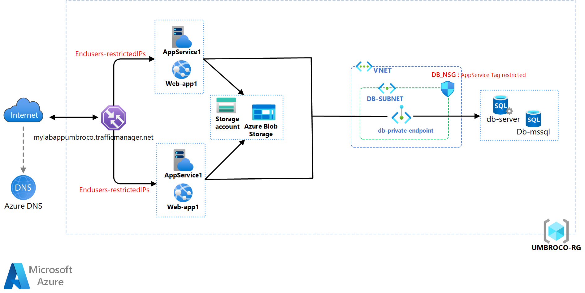

# Azure Web Application Infrastructure for EUMBROCO with terraform

This project contains Terraform modules for deploying a scalable and secure web application (umbroco) infrastructure in Azure.
Umbraco application (code and sql) deployment are out of this project scope


## Architecture

The infrastructure is composed of the following elements:


    - Azure Traffic Manager for DNS-based traffic load balancing.
    - Azure App Services for web applications.
    - Network Security Groups (NSGs) for securing network traffic to subnet.
    - Azure SQL Database for relational data storage.
    - Azure Blob Storage for unstructured data storage.

  ### **Security**
    - Endusers calls through traffic manager are restrictected to authorised CIDR in WEB APP site_config ( other options are possible such Service App environment with Vnet/subnet and NSG use )
    - Calls to MSSQL DB are restricted to SERVICE APP sources ( NSG with service tag as rule source) and managed through db private endpoint ( other options are possible such as private link)
    - Call to the blob storage are restricted but can done with private enpoint setup
    - Credentials such as db user/password have to be store in an Azure Key Vault ( Ensure that they are not committed to your version control system).

  ### **Scalability**
  Scalability can be done in two ways :
  1. Vertical : scale up/down of service plan sku
  2. Horizontal : scale in/out by adding other ServicePlan/WebApp instances

  ### **Disater recovery**
  Disater recovery can be handled through Azure Backup and/or Azure Site Recovery

<br><br>
## Modules

- `app_service`: Configures the App Services and App Service Plans.
- `blob_storage`: Creates the Storage Account and Blob Containers.
- `network-seurity`: Sets up the Resource Group, Virtual Network, Subnets, and NSG associations.
- `sql_database`: Deploys the Azure SQL Database and configures the SQL Server.
- `traffic_manager`: Manages the Traffic Manager Profile and its endpoints.

<br><br>
## Project structure

```sh
+--- environments                   # terraformed environments 
|   +--- dev                        # an example azure environment with standards files
|   +--- tf-vars                    # .tfvars and json variable files for environments
|   |   +--- dev.azure.tfvars       # .tfvars for Azure connecion settings
|   |   +--- dev.backend.json       # json file for terraform state, in json type for Azure Devops use as a secure file
|   |   +--- dev.tfvars             # .tfvars of this project 
+--- images
|   +--- ubmroco-lab.svg            # Architecture schema
+--- modules                        # terraform modules for provisioning & deploying an umbraco cms infrastructure
|   +--- app_service                # azure service_plan, windows_web_app and traffic_manager_azure_endpoint for the 2 applications
|   +--- blob_storage               # azure storage_account and storage_container
|   +--- network-security           # azure resource_group, virtual_network, dbsubnet, network_security_group and dbsubnet_network_security_group_association
|   +--- sql_database               # azure mssql_server, mssql_database and private_endpoint
|   +--- traffic_manager            # traffic_manager_profile
```

<br><br>
## Prerequisites
1. Terraform State file setting (environmen/tf-vars/dev.backend.json)
You will need an Azure storage account for terraform state remote storage

2. Azure connection (environmen/tf-vars/dev.azure.tfvars)
You will need an Azure sp account for Azure connection (subscription_id, client_id, client_secret,tenant_id)

3. Terraform correctly installed on your machine.

<br><br>
## Usage
  ### Adapt input files in environmen/tf-vars ( dev example in this projet)  
      Clone the repository to your machineand follow those stpes :
        1. environmen/tf-vars/dev.backend.json : fill with Requirements/1 information
        2. environmen/tf-vars/dev.azure.tfvars : fill with Requirements/2 information
        3. environmen/tf-vars/dev.tfvars : adapt inputs variable according to your needs


  ### Initiate your terraform remote workspace and execute your workload
      Follow the following steps :

  ```sh
cd environmen/dev

terraform init -backend-config=../tf-vars/dev.backend.json  -reconfigure

terraform plan -var-file=../tf-vars/dev.azure.tfvars -var-file=../tf-vars/dev.tfvars 

terraform apply -var-file=../tf-vars/dev.azure.tfvars -var-file=../tf-vars/dev.tfvars -auto-approve  

  ```

  ### Cleanup
      Follow the following steps for the clean up

  ```sh
cd environmen/dev

terraform destroy -var-file=../tf-vars/dev.azure.tfvars -var-file=../tf-vars/dev.tfvars -auto-approve  

  ```
<br><br>
## Contributions
Feel free to raise any remarks
